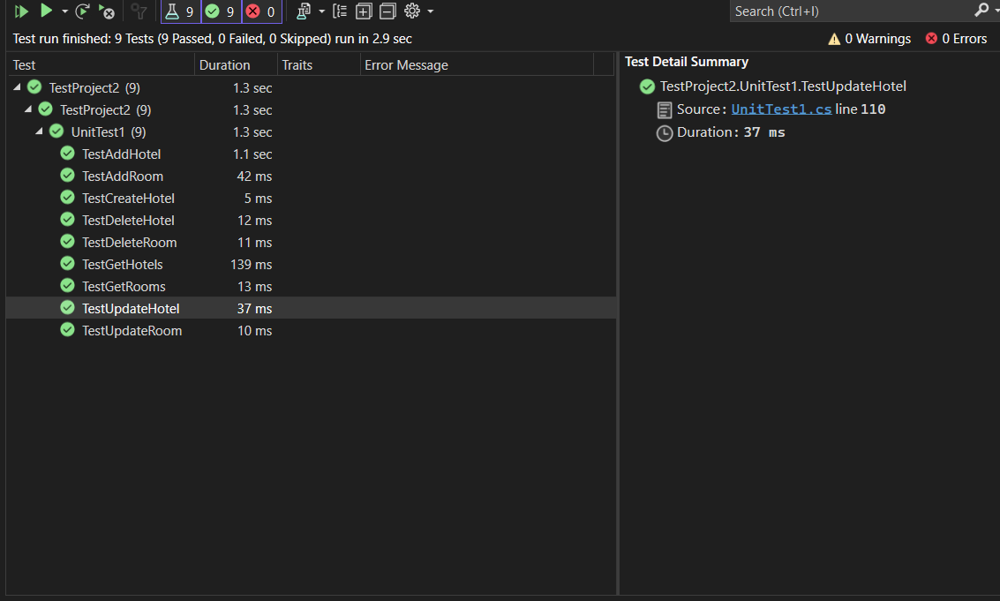

# Async-Inn
this is a simple api project that we will make on a several labs and it starts on the with the first lab 11 which will include the ERD(Entity Relationship Diagram and in lab 12 which is this one we will include the asp.net console web application that we did 
in this app we have made 3 models which are :

1.Room

2.Hotel

3.Amenity

and we made a controller to view it in a jason.
Take notice:
you need to downloads packages as microsoft entity framework tool,microsoft entity framework design,microsoft entity framework SQL server.
## Digram:


## Explanation:

1. Location entity: Represents a hotel location.
   - `location_id`: Unique identifier for each hotel location.
   - `name`: Name of the hotel location.
   - `city`: City where the hotel is located.
   - `state`: State where the hotel is located.
   - `address`: Street address of the hotel.
   - `phone_number`: Contact phone number for the hotel location.
   - `#no_room`:how many rooms in the location.

2. Room entity: Represents a hotel room.
   - `room_id`: Unique identifier for each hotel room.
   - `room_number`: Room number of the hotel room.
   - `nickname`: Nickname given to the room for better differentiation.
   - `layout_design `: Type of the room (e.g., one-bedroom, two-bedroom, studio).


3. Amenity entity: Represents the amenities available in a room.
   - `amenity_id`: Unique identifier for each amenity.
   - `name`: Name of the amenity.


4.Room_Amenity (associative table): Represents the amenities available in a room with each other .
 - `room_id`: forign key for each hotel room.
 - `amenity_id`: forign key for each hotel room.
 - `price`: Price of the room.
 - `pet_friendly`: Indicates whether the room is pet-friendly.
   
5.Location_Room (associative table): Represents the location for each room  .
 - `room_id`: forign key for each hotel room.
 - `location_id`: forign key for each hotel location.
## Relationships:
- Each location can have multiple rooms (many-to-many relationship): The location entity is related to the Room entity through an associative table as there would be many roms inmany locations.
- Each room can have multiple amenities (many-to-many relationship): The Amenity entity is related to the Room entity through an associative table.
##  Joint Entity Table with Payload Tables:
the Room_Amenity table serves as a Joint Entity Table with Payload table, consisting of foreign keys that reference the primary keys of the Room and Amenity tables and includes  additional attributes or payload information.
additional attributes:
   - `price`: Price of the room.
   - `pet_friendly`: Indicates whether the room is pet-friendly.
##  Pure Joint Tables:
the Location_Room table serves as a  Pure Joint table, consisting of foreign keys that reference the primary keys of the location  and Room tables and doesnot includes  any additional attributes or payload information.
 ## DTO:
 software development, DTO (Data Transfer Object) is a design pattern used to transfer data between different layers of an application. It is commonly used in service-oriented architectures or when data needs to be sent between different components or systems. 
in this project there are 4 DTOs add to the project to help transfare the data between the layers :

-AmenitDTO

-RoomDTO

-HotelDTO

-HotelRoomDTO

## login and register (Identity):
 Identity refers to a system that manages and represents user authentication and authorization.
 It is a core component of building secure web applications and managing user access to various resources within the application.
 you will send a body for regestration as the dto pf the regestration and will reseve the dto of the user.
 in my code it is  used in the regeister path and the login path this is impelment in this codes:
```c#
  public async Task<UserDTO> Authenticate(string username, string password)
        {
            var user = await userManager.FindByNameAsync(username);

            bool validPassword = await userManager.CheckPasswordAsync(user, password);

            if (validPassword)
            {
                return new UserDTO { Id = user.Id, Username = user.UserName };
            }
            return null;
        }

        public async Task<UserDTO> Register(RegisterUserDTO registerUser, ModelStateDictionary modelState)
        {
          

            var user = new ApplicationUser()
            {
                UserName = registerUser.Username,
                Email = registerUser.Email,
                PhoneNumber = registerUser.PhoneNumber,
            };

            var result = await userManager.CreateAsync(user, registerUser.Password);


            if (result.Succeeded)
            {
                return new UserDTO()
                {
                    Id = user.Id,
                    Username = user.UserName
                };
            }

            foreach (var error in result.Errors)
            {
                var errorKey = error.Code.Contains("Password") ? nameof(registerUser.Password) :
                               error.Code.Contains("Email") ? nameof(registerUser.Email) :
                               error.Code.Contains("Username") ? nameof(registerUser.Username) :
                               "";

                modelState.AddModelError(errorKey, error.Description);
            }

            return null;
        }
    }

```

## Test for crud opreations Rooms and Hotels:


## Swagger:
this is a swagger add to the code to make it easyer for the development to greatly improve the development and documentation experience.
Swagger is a tool that allows you to generate interactive API documentation, making it easier for developers to understand and interact with your API.
# this is the packgages add to implement the swagger:
`Swashbuckle.AspNetCore`
# this is the code add to apply swagger:
```c#
    app.UseSwaggerUI(options =>
            {
                options.SwaggerEndpoint("/api/v1/swagger.json", "Async Inn API");
                options.RoutePrefix = "docs";
            });
```
```c#
   builder.Services.AddSwaggerGen(option =>
            option.SwaggerDoc("v1", new Microsoft.OpenApi.Models.OpenApiInfo()
            {
                Title = "Async Inn API",
                Version = "v1",
            })
            );
```
```c#
var app = builder.Build();
            app.UseSwagger(options=>
            options.RouteTemplate="api/{documentName}/swagger.json");
```

## Repository Pattern:
`HotelService` and `RoomService` and `AmenityService`  which serves as a centralized data access component following characteristics of the **Repository Pattern**.
Despite being named as a "service," it functions as a repository for (hotel/room/amenity )related data operations. 
It abstracts the underlying data storage (database) using Entity Framework Core and exposes methods to handle creating, retrieving, updating, and deleting (hotel/room/amenity) data.

The `IHotel` `IRoom` `IAmenity` interfaces serves as a contract that any class representing a (hotel/room/amenity)   repository .
By defining these methods in the interface, the application can achieve decoupling between the data access layer and the rest of the application, enabling flexible data storage implementations and improving testability and maintainability.
## RoomAmenities routes:
this are the routes for the roomamentiy  table:
```c#
   [HttpPost("{roomId}/Amenity/{amenityId}")]
       
        public async Task<IActionResult> AddAmenityToRoom(int roomId, int amenityId)
        {
          
            await _room.AddAmenityToRoom(roomId,amenityId);

            return Ok();
        }
        [HttpDelete("{roomId}/Amenity/{amenityId}")]

        public async Task<IActionResult> DeleteAmenityToRoom(int roomId, int amenityId)
        {

            await _room.DeleteAmenityToRoom(roomId, amenityId);

            return Ok();
        }
    }

```
this routes were to add and delet form the table roomamentiy.


